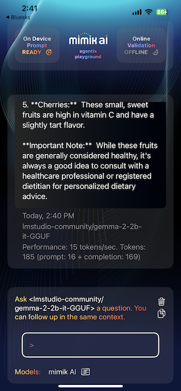
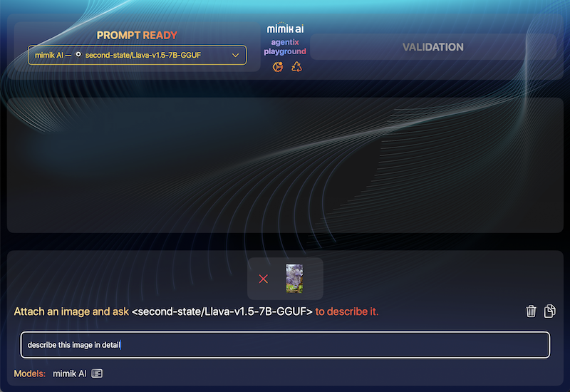
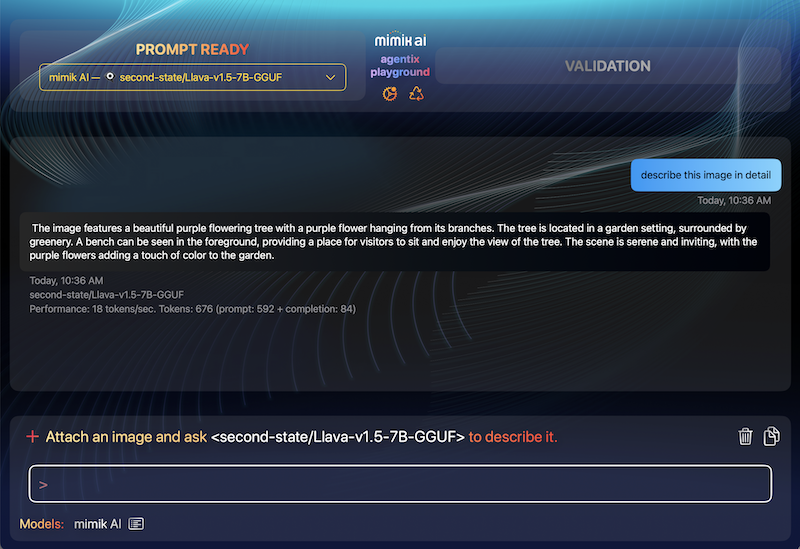

# Objective

The objective of this example is to demonstrate how mimik ai technology integrates into an iOS application, allowing you to download an AI language model onto your device, chat with it and even work when Offline.


# Technical Prerequisites

Connect a **real iOS device** to your computer and select it as the target in  Xcode.

|**NOTE:** <br/><br/>Working with the iOS Simulator and the mimik Client Libraries entails some special consideration. For more more information about iOS Simulator support see [this tutorial](https://devdocs.mimik.com/tutorials/12-index#workingwithaniossimulator).|
|----------|

# Example Application uses the mimik Client Library

The mimik Client Library simplifies usage and provides straightforward interfaces to streamline mimOE startup, authorization, and microservice deployment at the edge.

# Getting the Source Code

The place to start is cloning the code from GitHub and loading it into Xcode.

Execute the following command to clone the example code from GitHub:

```
git clone https://github.com/mimikgit/mimik-ai-chat-example-iOS.git
```

# Adding the mimik Client Library cocoapods

The mimik Client Library comes in a form of [EdgeCore](https://github.com/mimikgit/cocoapod-EdgeCore/releases) and [mimOE-SE-iOS-developer](https://github.com/mimikgit/cocoapod-mimOE-SE-iOS-developer/releases) cocoapods that need to be made available to the application source code.

We have setup these references in the Podfile file at the project level for you.

**Step 1**:** From the command line run the following command to get to the Xcode project directory.

```
cd mimik-ai-chat-example-iOS/mimik-ai-chat-example/
```

**Step 2**:** From the command line run the following command (from inside the Xcode project directory).

```
pod install --repo-update
```

**Step 3:** Start editing the `config-developer-id-token` file with:

```
open config-developer-id-token
```

Go to the mimik Developer Portal and generate the Developer ID Token from an edge project. 

Once generated, copy the Developer ID Token and then paste it into the `config-developer-id-token` file, replacing any existing content already there. Save and Close the file.


**Step 4:** Continue by editing the `config-developer-mimOE-license` file with:

```
open config-developer-mimOE-license
```

Go to the mimik Developer Portal and copy the Developer mimOE License from there. 

Once copied, paste the mimOE License into the `config-developer-mimOE-license` file, replacing any existing content already there. Save and Close the file.

**Step 5:** Continue by editing the `config-mimik-ai-use-case-api-key` file with:

```
open config-mimik-ai-use-case-api-key
```

This is your own API key value that will be used to secure the API calls within the mimik ai package.

Once you thought of one, paste your API key into the `config-mimik-ai-use-case-api-key` file, replacing any existing content already there. Save and Close the file.

**Step 6:** Continue by noting the content of the `config-mimik-ai-use-case-url` and `config-ai-model1-download.json` files with:

```
open config-mimik-ai-use-case-url; open config-ai-model1-download.json
```

These files have predefined values that you don't need to change (but you can, if you wish). Just take note of their content.


**Step 7:** From the command line run the following command in your project directory to open Xcode.

```
open mimik-ai-chat.xcworkspace
```

# Running the example on your iOS Device

|**Connect a real iOS device** to your development Mac and **select it as the target** in Xcode. Preferrably a fast device capable of running the latest iOS version. The AI language models are complex and require a lot of CPU power to work. This example will not work with an iOS Simulator.|
|----------|

Run the project in Xcode and follow the UI prompts on the iOS device to continue there.


# How to use the Example Application

When run for the first time, the example application welcomes you with a `START HERE` button at the bottom. Tap it as shown below.


# Downloading AI language model

A small menu for adding AI language models then opens with an `Add AI model` button. Tap it.


A new window sheet opens, showing the default values for a gemma-1.1-2b-it-GGUF AI language model from lmstudio-community. These predefined values are loaded from the `config-ai-model-request.json` file that you have inspected earlier. You can leave the defaults in and tap on the `START DOWNLOAD` button.


**Wait until the language model download completes**. Depending on your device and internet speed it might take a **fair amount of time**. This is a 1.7GB file download. The download can be cancelled by tapping the `Cancel Request` button.


# Chatting with the AI language model

**Once the AI language model download completes**, a new `Enter your question here` prompt appears. This is when the example application is ready for you to start asking the downloaded AI language model some questions.


Type in your question and the responses start streaming in the middle of the screen.

  

You can wait until the stream ends (indicated by the word `[Done]`) or cancel the stream by tapping on the `Cancel Request` button.

# Managing downloads

To remove the downloaded AI language model, tap on the `Manage Download` button and select `Remove All Models`.

To select a different downloaded AI language model to chat to, tap on the `Manage Download` button and select the model by tapping on it. This is when you have more than one downloaded model.


# Also works Offline

Since the AI language model gets fully downloaded onto your device, the example application can chat with the model **even when the device's internet connection is disabled**. For example in an airplane mode. Of course, you'd have to had the AI language model downloaded, before going offline.

  

# Test Flight

This example application is also available as a pre-configured download on Test Flight.

* Open and accept [this Test Flight link](https://testflight.apple.com/join/qoSKwIAE) on the iOS device you want the application to install on. 

* Open the application once done installing through Test Flight.
