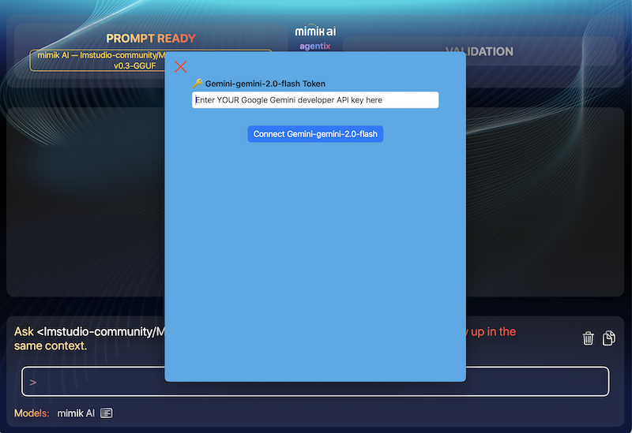
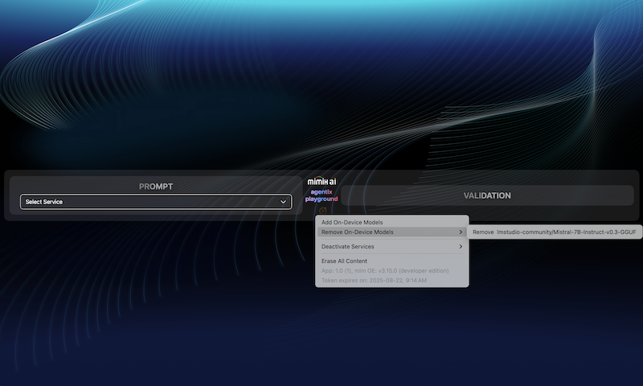
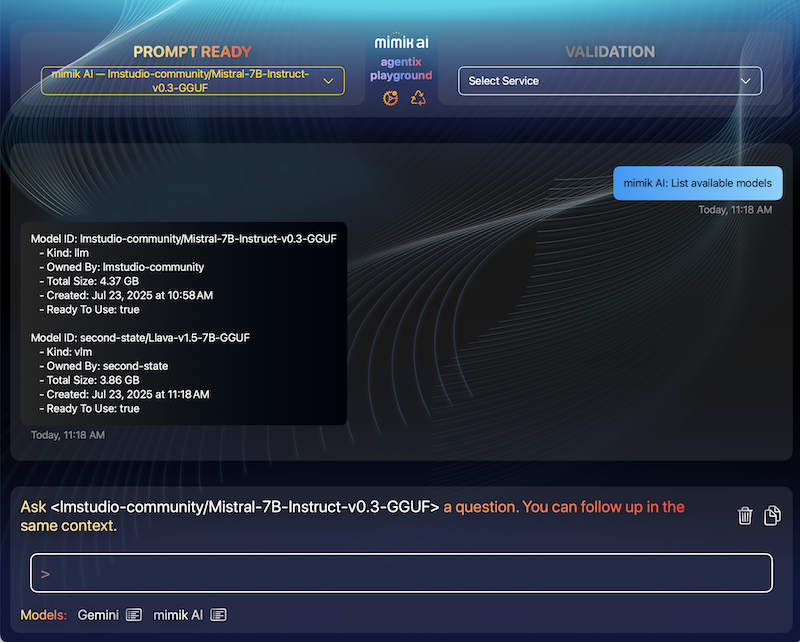

# Objective

The **Agentix Playground** is a sample iOS app that showcases how to integrate **mimik AI** into your iOS projects. It lets you locally download and run an AI language model directly on-device, enabling powerful, private, offline-capable AI in a hybrid edge-cloud architecture.

As an added option, it also supports validating assistant prompts via **Google Gemini**, using an online API.

When running on **Apple Silicon Macs**, the app unlocks additional capabilities, such as interacting with **Vision-Enabled Language Models**. You can upload images and receive intelligent feedback — all within the same Swift-based codebase.

Built on **EdgeClient.AI.ServiceInterface** from the **mimik Client Library**, a unified abstraction layer that simplifies working with AI models across device, edge, and cloud—while supporting streaming responses and real-time model discovery.


# Prerequisites

Before you begin:

- You **must use a physical iOS device** connected to your Mac.  
  > The iOS simulator is **not supported** due to native dependencies.
  
- Alternatively, you can run the app directly on an **Apple Silicon Mac**.

> ⚠️ Vision-Enabled Model features require Apple Silicon (M1/M2/M3) Macs.

# Get the Code

Clone the sample project from GitHub and open it in Xcode:

```bash
git clone https://github.com/mimikgit/mimik-ai-chat-example-iOS.git
```

# Install Dependencies with CocoaPods

This project uses two custom CocoaPods from mimik:

- [EdgeCore](https://github.com/mimikgit/cocoapod-EdgeCore)  
- [mim-OE-ai-SE-iOS-developer](https://github.com/mimikgit/cocoapod-mim-OE-ai-SE-iOS-developer)

These pods are already listed in the `Podfile`, so you just need to install them.

## Step 1: Navigate to the Source Directory

```bash
cd mimik-ai-chat-example-iOS/Source/
```

## Step 2: Install Pods

```bash
pod install --repo-update
```

# Configure Runtime Credentials

The app relies on a few configuration files for runtime credentials and model setup.

## Step 3: Developer ID Token

Open the token file:

```bash
open config-developer-id-token
```

Go to the [mimik Developer Console](https://console.mimik.com), create a new edge project, and generate a **Developer ID Token**.  
Paste it into the file and save.  
➡️ [View Tutorial](https://devdocs.mimik.com/tutorials/01-submenu/01-submenu/02-index)

## Step 4: mim OE License

Open the license file:

```bash
open config-developer-mim-OE-license
```

From the [Developer Console](https://console.mimik.com), copy your **mim OE (Edge) License** and paste it into this file. Save and close.

## Step 5: Developer API Key

Open the API key file:

```bash
open config-mimik-ai-use-case-api-key
```

Paste your API key here — this secures your API calls within the app. Save and close.

## Step 6: Review AI Model Configs

You can inspect the model configuration files by running:

```bash
open config-ai-model4-download.json; open config-ai-model5-download.json
```

These contain predefined URLs and settings for downloading AI models. You don’t need to modify them unless you're customizing models.

# Launch in Xcode

To open the workspace in Xcode:

```bash
open mimik-ai-chat.xcworkspace
```

From here, select your physical iOS device or your Apple Silicon Mac as the run target, then **Build & Run** the project.

You're now ready to explore on-device AI with mimik in a real-world iOS app!


# Running the Example on a Real iOS Device

|**Connect a real iOS device** to your Mac and **select it as the target** in Xcode. For best results, use a device capable of handling complex AI models. The iOS Simulator is **not supported**.|
|----------|

Once connected, run the project from Xcode and follow the on-device prompts to proceed.

# Running on Apple Silicon Macs

With Apple's transition to Apple Silicon, you can now run iOS apps — including this example — **natively on macOS** directly. This also includes native support for the mim OE Runtime binary.

Running on Mac provides full debugging, profiling, and testing capabilities in Xcode, just like an iOS device.

> 📚 Learn more: [Adapting iOS code for macOS (Apple Silicon)](https://developer.apple.com/documentation/apple-silicon/adapting-ios-code-to-run-in-the-macos-environment)

# Getting Started with the Example App

After launching the app, tap the `START HERE` button to begin.


---

## Step 1: Download an AI Language Model

Tap the `Add AI Model` button in the system menu.


You’ll see two default model presets:

- `gemma-v2-2b` (recommended)
- `gemma-v1.1-2b`

These are downloaded based on configurations in:

- `config-ai-model5-download.json`
- `config-ai-model4-download.json`

Select `gemma-v2-2b`, then tap `START DOWNLOAD`.


> 💡 On Apple Silicon Macs, you’ll see **five model options**, including one Vision-Enabled model.

---

## Step 2: Monitor Download Progress

Download time varies based on your connection and device speed. A progress indicator will keep you updated.


### Tips:
- Keep the app open and the device awake.
- You can cancel the download at any time using the `X` button.

---

# Interacting with the AI Language Model

Once downloaded, a `>` prompt appears — indicating you're ready to chat with the AI.


Type your question, and the AI will stream its response in real time.

 

- Tap `X` to cancel a response mid-stream.
- At the end, the app will display token throughput — helpful for performance insight.

---

## Context-Aware Conversations

The app includes previous interactions in follow-up prompts, allowing for **context-aware responses**.

  

You can manage the conversation easily:

- **Clear** to reset the context.
- **Copy** to save the conversation to your clipboard.

---

## Vision-Enabled Language Models (Mac Only)

On Apple Silicon Macs, you’ll have access to a Vision Language Model. This allows you to upload images and receive descriptive feedback.

> ❗ Vision models currently do **not** support context-aware chat.

  
  


---

## Google Gemini Prompt Validation (Mac Only)

### Overview

Enable real-time response verification by sending on-device model outputs to Google Gemini for cross-checking—ideal for testing accuracy and consistency in hybrid AI workflows.

### How to Activate

1. In the app, go to **Online Validation** and activate **Google Gemini**.
2. When prompted, enter your **Google Gemini Developer API Key**.
3. Tap **Connect** to activate the service.

### Notes

- Currently, **Google Gemini** is the only supported online validation backend.
- You must provide your **own Google Gemini API key**.
- **Contextual follow-up prompts** are supported only during on-device sessions and are **disabled** when online validation is active.
- Online services **do not return tokens-per-second** performance metrics at this time.


  
  


---

# Models

## Manage Downloaded Models

Use the in-app settings (tap the left **Gear icon**) to manage your downloaded AI models:

- **Add a model**: Tap **Add New Model** to browse and download a new AI model.
- **Switch models**: Tap **Select**, then choose the model you want to use.
- **Delete a model**: Tap **Remove**, then select the model you want to delete.
- **Clear all models**: Tap **Remove Everything** to delete all downloaded models and reset the app.

  


## View Available Models

To see a list of available models—either stored on your device or provided by active online services—tap the **List Models** button in the **Models** section at the bottom of the screen.

  


---

## Works Fully Offline

Once a model is downloaded, the app works **entirely offline** — no internet required, even in airplane mode.

> Just be sure the model download has completed beforehand.

---


## Try It with TestFlight

Want to test without building it yourself? Install the app using TestFlight:

1. Open this [TestFlight link](https://testflight.apple.com/join/qoSKwIAE) on your iOS device.
2. Accept the invitation and launch the app.

---

# Additional Resources

Explore more iOS + mimik AI development concepts here:

- [Understanding the mimik Client Library for iOS](/key-concepts/10-index)
- [Creating a Simple iOS App Using an Edge Microservice](/tutorials/01-submenu/02-submenu/01-index)
- [Integrating mimik Client Library into iOS Projects](/tutorials/01-submenu/02-submenu/02-index)
- [Working with Edge Microservices in iOS](/tutorials/01-submenu/02-submenu/04-index)
- [AI Language Models in iOS Projects](/tutorials/02-submenu/02-submenu/01-index)