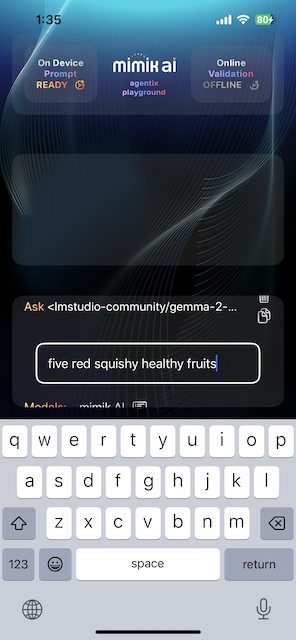

# Objective

The Agentix Playground example app showcases how mimik ai seamlessly integrates with iOS. It enables users to locally download an AI language model to their device, interact with it directly, and continue using it even when offline — offering powerful, private, on-device AI capabilities in a hybrid-edge cloud environment.

When run on Apple Silicon Macs, the experience goes even further. Users can download and engage with Vision-Enabled Language Models, upload images, and receive intelligent, descriptive feedback — all within the same application.

# Prerequisites

To run this example, **developers must connect a physical iOS device** to their development Mac and set it as the build target. The iOS simulator is not supported.

**For Vision-Enabled Models, an Apple Silicon Mac is required.**


# Getting the Source Code

To begin, clone the code from GitHub and open it in Xcode.

Execute the following command to clone the example code:


```
git clone https://github.com/mimikgit/mimik-ai-chat-example-iOS.git
```


# Adding the mimik Client Library pods

The mimik Client Library is provided through two CocoaPods:

- [EdgeCore](https://github.com/mimikgit/cocoapod-EdgeCore)  
- [mim-OE-ai-SE-iOS-developer](https://github.com/mimikgit/cocoapod-mim-OE-ai-SE-iOS-developer)

These CocoaPods need to be integrated into your application's source code.

For your convenience, we've already added the necessary references to the project's `Podfile`.


### Step 1: Navigate to the Xcode Project Directory

From the command line, run the following command to navigate to the Xcode project directory:

```
cd mimik-ai-chat-example-iOS/Source/
```

### Step 2: Install the CocoaPods

From the command line, run the following command **inside the Xcode project directory**:

```
pod install --repo-update
```

### Step 3: Edit the `config-developer-id-token` File

To start editing the `config-developer-id-token` file, run the following command:

```
open config-developer-id-token
```

Go to the [mimik Developer Console](https://console.mimik.com) and generate a Developer ID Token for an edge project you create.

Once generated, copy the token and paste it into the `config-developer-id-token` file, replacing any existing content. Save and close the file.


### Step 4: Edit the `config-developer-mim-OE-license` File

Next, edit the `config-developer-mim-OE-license` file by running the following command:


```
open config-developer-mim-OE-license
```

Go to the [mimik Developer Console](https://console.mimik.com) and copy your Developer mim OE (Edge) License.

For more details, you can read [this tutorial](https://devdocs.mimik.com/tutorials/01-submenu/01-submenu/02-index).

Once copied, paste the mim OE License into the `config-developer-mim-OE-license` file, replacing any existing content. Save and close the file.


### Step 5: Edit the `config-mimik-ai-use-case-api-key` File

Next, edit the `config-mimik-ai-use-case-api-key` file by running the following command:

```
open config-mimik-ai-use-case-api-key
```

This is your own API key, which will be used to secure the API calls within the mimik ai package.

Once you have your API key, paste it into the `config-mimik-ai-use-case-api-key` file, replacing any existing content. Save and close the file.

### Step 6: Review additional Files

Next, review the contents of the `config-ai-model4-download.json` and `config-ai-model5-download.json` files by running:

```
open config-ai-model4-download.json; open config-ai-model5-download.json
```

These two files contain predefined model download configuration values that you don't need to change (though you can, if you need to). Simply take note of their content.


### Step 7: Open Xcode

From the command line, run the following command in your project directory to open Xcode:


```
open mimik-ai-chat.xcworkspace
```

# Running the example on your iOS Device


|**Connect a real iOS device** to your development Mac and **select it as the target** in Xcode. For optimal performance, use a fast device capable of running complex AI language models. This example will not work with the iOS Simulator.|
|----------|

Run the project in Xcode and follow the on-screen prompts on the iOS device to continue.

# Mac computers with Apple silicon

With the transition from Intel to Apple Silicon architecture in Mac desktop computers, it is now possible to run most iOS applications, including this example [natively](https://developer.apple.com/videos/play/wwdc2020/10114/) on desktop Macs without requiring any changes. This includes the mim OE Runtime binary.

The ability to run iPhone and iPad apps natively on Apple Silicon Macs opens up a whole new set of users. Apple has done much of the heavy lifting to make this seamless, so developers only need to make minimal adjustments.

The good news is that Xcode provides excellent support for debugging, testing, and profiling iPhone and iPad apps natively on a Mac, just as if they were running in a simulator or on an actual iOS device.

For more details, check out [Apple's documentation](https://developer.apple.com/documentation/apple-silicon/adapting-ios-code-to-run-in-the-macos-environment).


# Getting Started with the Example Application

When you first launch the example application, you’ll be greeted with a `START HERE` button. Simply tap it to begin.


---

## Downloading an AI Language Model

A small system menu will appear, featuring an `Add AI Model` button. Tap this to move forward.


You'll then see a new screen displaying two default presets:  
- `gemma-v2-2b`  
- `gemma-v1.1-2b`

These are provided by the **lmstudio-community**, and are loaded from the `config-ai-model5-download.json` and `config-ai-model4-download.json` files.

We recommend starting with the more intelligent `gemma-v2-2b` model. Select it, then tap `START DOWNLOAD` at the bottom of the screen to begin downloading.


> **Note:** If you're using a Mac, you’ll have access to five different model options — including one Vision-Enabled model.

---

## Download Progress and Tips

The download may take **a significant amount of time** depending on your device and internet connection. A progress indicator will keep you updated on the status.


**Important:**  
- Do **not** exit the app or lock your device during the download.  
- If needed, you can cancel the process at any time by tapping the `X` button.


# Chatting with the AI Language Model

**Once the AI language model has finished downloading**, a `>` prompt will appear on the screen. This indicates that the example application is ready for you to start interacting with the AI.



Simply type your question, and the AI will begin streaming its response in the center of the screen.

 

You can let the response finish naturally, or cancel it at any time by tapping the `X` button.

At the end of the response, you’ll also see a display showing token throughput performance — helpful for gauging processing speed.

---

## Context-Aware Responses (Language Models Only)

The application automatically includes previous messages when sending follow-up questions to the AI model. This allows for **context-aware responses**, where the AI remembers and builds upon earlier interactions.

  

You can manage the context easily:

- Tap **Clear** to reset the conversation.
- Tap **Copy** to save the current context to your clipboard.

---

## Vision-Enabled Language Models (Mac Only)

Support for Vision Language Models is currently **exclusive to Apple Silicon Macs**.

When running the application on a supported Mac, you’ll have access to additional models — including a Vision Language Model. This enables a powerful new use case: uploading an image and asking the model to describe it.

> **Note:** Context-aware conversation features are only available for language models — not Vision models.

  
  


# Managing AI Language Models

You can manage your downloaded AI models directly from within the app:

- **To switch to a different AI model**:  
  Tap the **Gear** icon, then select the model you'd like to use.

- **To delete a specific downloaded model**:  
  Tap the **Gear** icon, choose **Remove**, and then select the model you want to delete.

- **To remove all models and reset storage**:  
  Tap the **Gear** icon, go to **Remove**, and select **Remove Everything**.

  

---

## Works Offline Too

Once an AI language model is downloaded to your device, the application can function completely **offline** — even in airplane mode.  
This makes it ideal for travel or environments with limited connectivity.

> Just make sure the model is fully downloaded before going offline.

---

## Try It on TestFlight

The example application is also available as a pre-configured download via TestFlight.

1. On your iOS device, open and accept the invitation using this [TestFlight link](https://testflight.apple.com/join/qoSKwIAE).  
2. Once installed, open the app directly from TestFlight and start exploring.

---


# Additional reading

In order to get more out of this article, the reader could further familiarize themselves with the following concepts and techniques:

- [Understanding the mimik Client Library for iOS](/key-concepts/10-index).
- [Creating a Simple iOS Application that Uses an edge microservice](/tutorials/01-submenu/02-submenu/01-index).
- [Integrating the mimik Client Library into an iOS project](/tutorials/01-submenu/02-submenu/02-index).
- [Working with edge microservices in an iOS project](/tutorials/01-submenu/02-submenu/04-index).
- [Working with AI language models in an iOS project](/tutorials/02-submenu/02-submenu/01-index).
