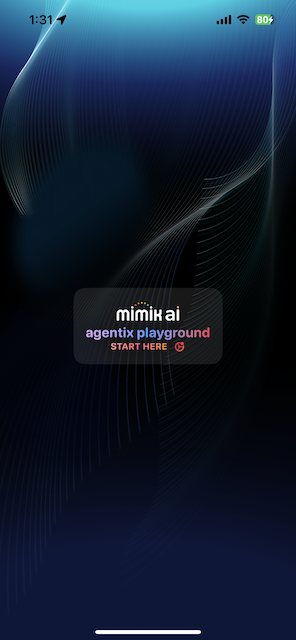
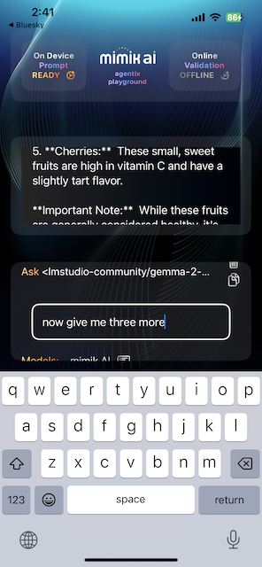

# Objective

The goal of this example is to demonstrate how mimik AI technology integrates into an iOS application. It allows you to download an AI language model to your device, interact with it, and even use it offline.

# Prerequisites

You will need to attach a **real iOS device** to your development Mac and select it as the build target. This example will not work with the iOS simulator.


# Getting the Source Code

To begin, clone the code from GitHub and open it in Xcode.

Execute the following command to clone the example code:


```
git clone https://github.com/mimikgit/mimik-ai-chat-example-iOS.git
```


# Adding the mimik Client Library cocoapods

The mimik Client Library is available as two CocoaPods: [EdgeCore](https://github.com/mimikgit/cocoapod-EdgeCore) and [mim-OE-ai-SE-iOS-developer](https://github.com/mimikgit/cocoapod-mim-OE-ai-SE-iOS-developer). These CocoaPods need to be integrated into your application's source code.

We have already set up these references in the `Podfile` at the project level for you.

### Step 1: Navigate to the Xcode Project Directory

From the command line, run the following command to navigate to the Xcode project directory:

```
cd mimik-ai-chat-example-iOS/Source/
```

### Step 2: Install the CocoaPods

From the command line, run the following command **inside the Xcode project directory**:

```
pod install --repo-update
```

### Step 3: Edit the `config-developer-id-token` File

To start editing the `config-developer-id-token` file, run the following command:

```
open config-developer-id-token
```

Go to the [mimik Developer Console](https://console.mimik.com) and generate a Developer ID Token for an edge project you create.

Once generated, copy the token and paste it into the `config-developer-id-token` file, replacing any existing content. Save and close the file.


### Step 4: Edit the `config-developer-mim-OE-license` File

Next, edit the `config-developer-mim-OE-license` file by running the following command:


```
open config-developer-mim-OE-license
```

Go to the [mimik Developer Console](https://console.mimik.com) and copy your Developer mim OE (edge) License.

For more details, you can read [this tutorial](https://devdocs.mimik.com/tutorials/01-submenu/01-submenu/02-index).

Once copied, paste the mim OE License into the `config-developer-mim-OE-license` file, replacing any existing content. Save and close the file.


### Step 5: Edit the `config-mimik-ai-use-case-api-key` File

Next, edit the `config-mimik-ai-use-case-api-key` file by running the following command:

```
open config-mimik-ai-use-case-api-key
```

This is your own API key, which will be used to secure the API calls within the mimik ai package.

Once you have your API key, paste it into the `config-mimik-ai-use-case-api-key` file, replacing any existing content. Save and close the file.

### Step 6: Review additional Files

Next, review the contents of the `config-mimik-ai-use-case-url` and `config-ai-model1-download.json` files by running:

```
open config-mimik-ai-use-case-url; open config-ai-model1-download.json
```

These files contain predefined values that you don't need to change (though you can, if necessary). Simply take note of their content.


### Step 7: Open Xcode

From the command line, run the following command in your project directory to open Xcode:


```
open mimik-ai-chat.xcworkspace
```

# Running the example on your iOS Device


|**Connect a real iOS device** to your development Mac and **select it as the target** in Xcode. For optimal performance, use a fast device capable of running complex AI language models. This example will not work with the iOS Simulator.|
|----------|

Run the project in Xcode and follow the on-screen prompts on the iOS device to continue.

# Mac computers with Apple silicon

With the transition from Intel to Apple Silicon architecture in Mac desktop computers, it is now possible to run most iOS applications, including this example [natively](https://developer.apple.com/videos/play/wwdc2020/10114/) on desktop Macs without requiring any changes. This includes the mim OE Runtime binary.

The ability to run iPhone and iPad apps natively on Apple Silicon Macs opens up a whole new set of users. Apple has done much of the heavy lifting to make this seamless, so developers only need to make minimal adjustments.

The good news is that Xcode provides excellent support for debugging, testing, and profiling iPhone and iPad apps natively on a Mac, just as if they were running in a simulator or on an actual iOS device.

For more details, check out [Apple's documentation](https://developer.apple.com/documentation/apple-silicon/adapting-ios-code-to-run-in-the-macos-environment).


# How to use the Example Application

When run for the first time, the example application welcomes you with a `START HERE` button. Tap it as shown below.




# Downloading AI language model


A small menu will appear, featuring an `Add AI Model` button. Tap this button to proceed.


A new window will open, displaying two default presets for the `gemma-v1.1-2b` and `gemma-v2-2b` AI language models from **lmstudio-community**. These presets are loaded from the `config-ai-model1-download.json` and `config-ai-model2-download.json` files, respectively. 

You can start by selecting the less complex `gemma-v1.1-2b` model, then tap the `START DOWNLOAD` button at the bottom to begin the download.


**Wait for the language model download to complete**. The download may take a **significant amount of time** depending on your device and internet speed, as the file size in this case is 1.8GB. 

**Important:** Do not leave the app or lock your device while the download is in progress. If needed, you can cancel the download by tapping the `Cancel Request` button.


# Chatting with the AI language model


**Once the AI language model download is complete**, a new `Enter your question` prompt will appear. At this point, the example application is ready for you to start asking questions to the downloaded AI language model.


Type your question, and the responses will begin streaming in the center of the screen.

 

You can either wait for the stream to finish (indicated by the word `[Done]`) or cancel it by tapping the `Cancel Request` button.

# Context aware

**The application sends context from the previous answers** to the AI model, when asking any follow up questions.

    


Context gets used to combine the previous answers.

  


Context can be cleared by tapping on the **Clear Context** button or copied to the system clipboard by tapping on the **Copy Context** button.


# Managing downloads

**To activate** a different AI language model, tap the bottom **Menu** button, then select the model you want by tapping on it.

**To delete** a specific downloaded AI language model, tap the **Menu** button, select **Remove**, and then choose the model you wish to delete by tapping on it.

**To remove** all downloaded AI language models and reset the storage in your device, tap the **Manage Models** button, select **Remove**, and then choose **Remove Everything**.


# Also works Offline


Since the AI language model is fully downloaded to your device, the example application can continue to chat with the model **even when the device's internet connection is disabled**, such as in airplane mode. 

However, you must ensure that the AI language model is downloaded before going offline.


# Test Flight

This example application is also available as a pre-configured download on Test Flight.

* Open and accept [this Test Flight link](https://testflight.apple.com/join/qoSKwIAE) on the iOS device you want the application to install on. 

* Open the application once done installing through Test Flight.


# Additional reading

In order to get more out of this article, the reader could further familiarize themselves with the following concepts and techniques:

- [Understanding the mimik Client Library for iOS](https://devdocs.mimik.com/key-concepts/10-index).
- [Creating a Simple iOS Application that Uses an edge microservice](https://devdocs.mimik.com/tutorials/01-submenu/02-submenu/01-index).
- [Integrating the mimik Client Library into an iOS project](https://devdocs.mimik.com/tutorials/01-submenu/02-submenu/02-index).
- [Working with edge microservices in an iOS project](https://devdocs.mimik.com/tutorials/01-submenu/02-submenu/04-index).
- [Working with AI language models in an iOS project](https://devdocs.mimik.com/tutorials/02-submenu/02-submenu/01-index).
