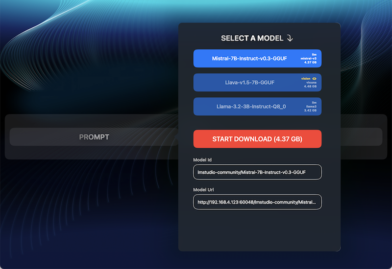
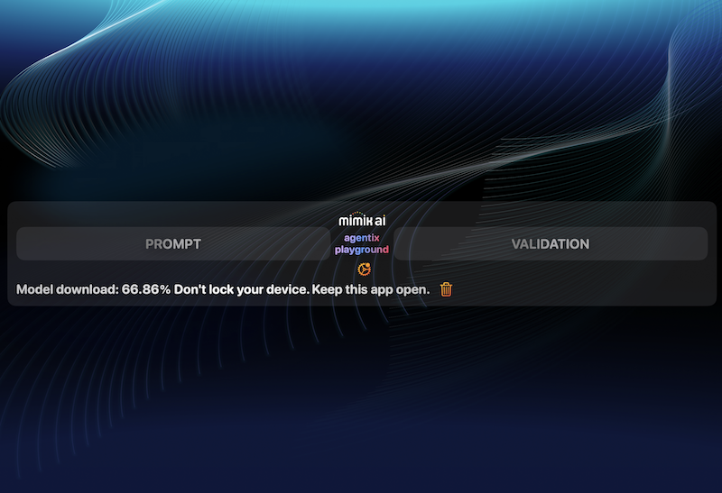
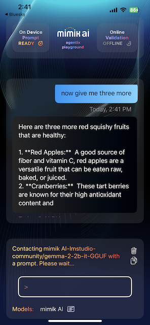
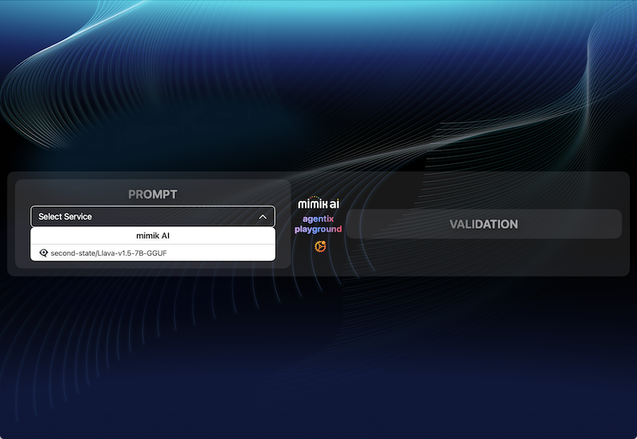
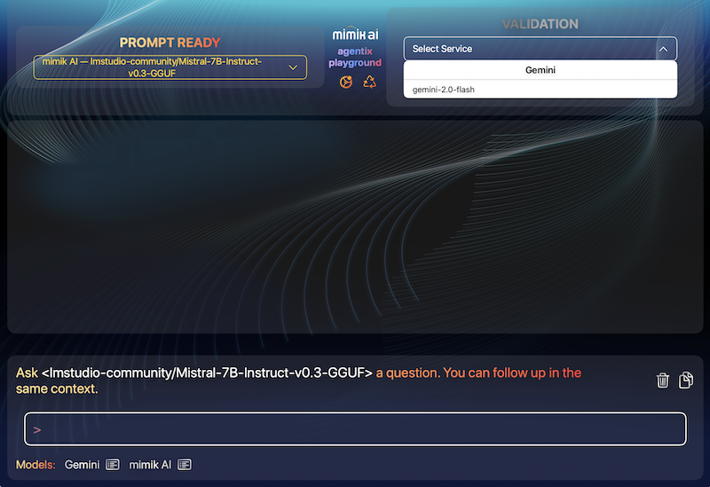
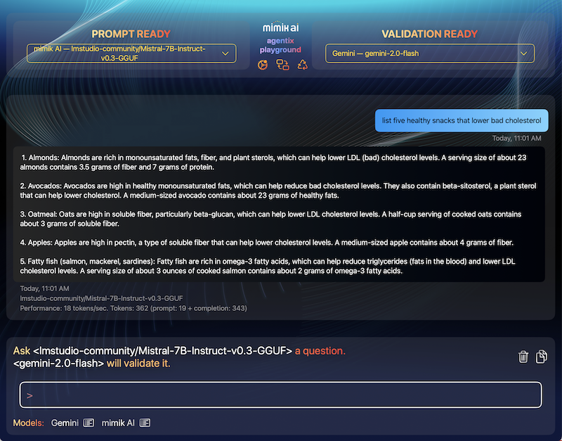

# Objective

The **Agentix Playground** is a sample iOS app that demonstrates how to integrate **mimik AI** into your iOS projects. It allows you to download and run language models directly on your device—enabling powerful, private, offline-capable AI through a hybrid edge-cloud architecture.

The app also supports activating online services (e.g., **Google Gemini**) and using them for prompt generation or response validation. You can mix and match on-device and cloud services as needed.

When running on **Apple Silicon Macs**, the app unlocks additional capabilities such as support for **Vision-Enabled Language Models**. You can upload images and receive intelligent visual feedback—within the same Swift-based codebase.

This example is built using **EdgeClient.AI.ServiceInterface**, part of the **mimik Client Library**. This unified abstraction layer simplifies working with AI models across device, edge, and cloud environments, supporting real-time streaming and discovery.

---

# Prerequisites

Before getting started:

- You **must use a physical iOS device** connected to your Mac.  
  > The iOS Simulator is **not supported** due to native dependencies.

- Alternatively, you can run the app on an **Apple Silicon Mac**.

> ⚠️ Vision-enabled features are available **only** on Apple Silicon Macs, for now.

---

# Get the Code

Clone the project and open it in Xcode:

```bash
git clone https://github.com/mimikgit/mimik-ai-chat-example-iOS.git
```

---

# Install Dependencies (CocoaPods)

The project uses two custom CocoaPods:

- [EdgeCore](https://github.com/mimikgit/cocoapod-EdgeCore)  
- [mim-OE-ai-SE-iOS-developer](https://github.com/mimikgit/cocoapod-mim-OE-ai-SE-iOS-developer)

These are already declared in the `Podfile`.

### Step 1: Navigate to the Source Directory

```bash
cd mimik-ai-chat-example-iOS/Source/
```

### Step 2: Install Pods

```bash
pod install --repo-update
```

---

# Configure Runtime Credentials

The app requires a few configuration files for runtime access and model setup.

### Step 3: Developer ID Token

```bash
open config-developer-id-token
```

Generate a **Developer ID Token** in the [mimik Developer Console](https://console.mimik.com) and paste it into this file.  
➡️ [Tutorial](https://devdocs.mimik.com/tutorials/01-submenu/01-submenu/02-index)

### Step 4: mim OE License

```bash
open config-developer-mim-OE-license
```

Paste your **mim OE License** from the Developer Console into this file.

### Step 5: Your API Key

```bash
open config-mimik-ai-use-case-api-key
```

Paste your API key to authenticate app calls.

### Step 6: Review Model Configurations

```bash
open config-model-04-gemma2b.json; open config-model-05-gemma11.json
```

These JSON files define model download URLs and settings. You can leave them as-is unless you're customizing models.

---

# Launch in Xcode

Open the workspace:

```bash
open mimik-ai-chat.xcworkspace
```
 And run on either a **physical iOS device** or **Apple Silicon Mac**.

---

# Running the Example on Devices

## iOS Devices

**Connect a physical iOS device** and select it in Xcode as the run target. For optimal performance, use a device capable of running AI models. Simulator is not supported.

Run the app and follow the on-device prompts to continue.

> ⚠️ iOS Simulators are not supported, use a physical device.


## Apple Silicon Macs

Apple Silicon Macs can run iOS apps natively on macOS, including the iOS mim OE binary.

Select **My Mac (Designed for iPad)** it in Xcode as the run target.

Run the app and follow the on-device prompts to continue.

> 📚 Learn more: [Adapting iOS code to macOS (Apple Silicon)](https://developer.apple.com/documentation/apple-silicon/adapting-ios-code-to-run-in-the-macos-environment)

---

# Getting Started in the App

After launching the app, tap the **START HERE** button.


---

# Assistant Prompt Service Setup

To start, you'll download an on-device model and set it as the **Prompt Service**.

> Later, you'll use another service (e.g., Gemini) as the **Validation Service** for hybrid workflows.

### Download a language Model

Tap **Add On-Device Models** in the system menu.


You’ll see two model presets:

- `gemma-v2-2b` (recommended)
- `gemma-v1.1-2b`

These models are defined in:

- `config-model-04-gemma2b.json`
- `config-model-05-gemma11.json`

Select `gemma-v2-2b`, then tap **START DOWNLOAD**.


> 💡 On Apple Silicon Macs, five models will be listed, including a Vision-Enabled model.



---

### Monitor Download Progress



**Tips:**
- Keep the app active and the screen awake.
- Use the button to cancel at any time.

---

# Chat with the Prompt Service

Once the model is ready, a `>` prompt appears for chatting with the on-device assistant.


Type your query, and the assistant will stream its response in real time.

 

- Tap a button to stop a response mid-stream.
- The app displays token throughput after each response.

---

## Context-Aware Conversations

The assistant maintains session context across prompts for more natural, coherent interactions.

  

Manage the conversation with:

- **Clear** – resets the chat history.
- **Copy** – saves the conversation to clipboard.

---

## Vision-Enabled Models (Mac Only)

On Apple Silicon Macs, Vision Language Models allow image input with descriptive feedback.

> ❗ Vision models **do not support** multi-turn chat or context chaining.


  
  


---

# Assistant Validation Service

To demonstrate hybrid AI workflows, you’ll set up **Google Gemini** as the Validation Service to verify responses from on-device models.

### Activate Google Gemini

1. Tap **Activate Services**, then choose **Gemini**.
2. Enter your **Google Gemini Developer API Key**.
3. Tap **Connect** to activate the service.

### Notes:

- Google Gemini is the only supported online validation service (for now).
- You must provide your own Gemini API key.
- Contextual chaining is disabled while online services are active.
- Online responses do **not** include token throughput stats.

  
  
  
  


---

# Settings Menu

Access app settings via the gear icon:

- **Add On-Device Models** – Download new models.
- **Remove On-Device Models** – Delete existing model files.
- **Erase All Content** – Reset the app and delete all models.
- **Deactivate Services** – Disconnect from online services.

  


### View Available Models

Tap **List Models** at the bottom of the screen to view all available models (on-device and online).

  


---

## Works Fully Offline

Once a model is downloaded, the app functions 100% offline—even in airplane mode.

> Ensure downloads are complete before disconnecting from the internet.

---

## Mix & Match On-Device and Online Services

Once you have at least one on-device model and one active online service, you can:

- Choose either as the **Prompt** or **Validation** service.
- Use the **swap** button to quickly exchange the two.

---

## Try It with TestFlight

Prefer not to build the app yourself?

1. Open [this TestFlight link](https://testflight.apple.com/join/qoSKwIAE) on your iOS device.
2. Accept the invitation and install the app.

---

# Additional Resources

Learn more about iOS + mimik AI integration:

- [Understanding the mimik Client Library for iOS](https://devdocs.mimik.com/key-concepts/10-index)
- [Creating a Simple iOS App with Edge Microservices](https://devdocs.mimik.com/tutorials/01-submenu/02-submenu/01-index)
- [Integrating mimik into an iOS Project](https://devdocs.mimik.com/tutorials/01-submenu/02-submenu/02-index)
- [Working with Edge Microservices in iOS](https://devdocs.mimik.com/tutorials/01-submenu/02-submenu/04-index)
- [Using AI Models in iOS](https://devdocs.mimik.com/tutorials/02-submenu/02-submenu/01-index)
